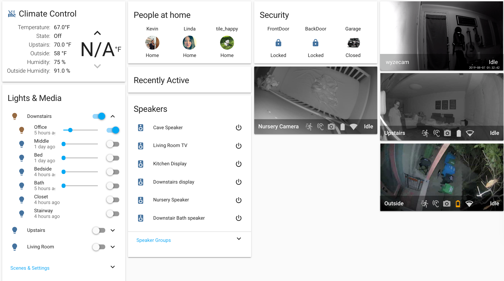

    <figure>
        

            
        

    </figure>

### Goals 
- **Full home automation with wife acceptance**

### Climate control 🌡
- **Lyric Thermostat** [WiFi] 

### Door Locks and Garage 👮
- **Schlage BE469 Touchscreen Deadbolt** [Z-Wave] (x2) front/back door locks and sounds alarm if forced entry
- **[OpenGarage](https://opengarage.io/)** [WiFi] to control and monitor garage door 

### Cameras
- **Arlo Ultra 4K UHD Security System** (x2)
- **Arlo Baby** 
- **WyzeCam v2**

### Speakers and Entertainment Systems 
- **Google Nest Hub** (x2) for displays 
- **Google Home**  
- **Google Home Max**
- **JBL Link 500**  
- **Insignia NS-CSPGASP** 
- **NVIDIA SHIELD Android TV**

### Light switches
- **GE 26933 Smart Motion Dimmer** [Z-Wave] (x2) great light switches for motion detection in bathroom and stairway 
- **HomeSeer HS-WD200+ Wall Dimmer** [Z-Wave] (x2) great light switches with easy to use dimmer lights
- **GE 26931 Smart Motion Switch** [Z-Wave] 
- **GE 14294 In-Wall Smart Dimmer** [Z-Wave] 
- **Zooz ZEN23 Toggle Switch V2.0** [Z-Wave]

### Light Bulbs
- **LIFX Mini White** [WiFi]

### Sensors 📡
- **FIBARO System FGMS001-ZW5 Motion Sensor** [Z-Wave]
- **Neo CoolCam Battery Powered PIR Sensor** [Z-Wave]
- **Kaipule PIR Celling Sensor** [Z-Wave]
- **Xiaomi Mi Smart Home Aqara Human Body Sensor** (x2) works through the Xiaomi gateway 

<a href="#top" title="Back to top">🔝</a>

### Human interfaces 
- **[Aeotec ZW130 WallMote Quad](https://www.youtube.com/watch?v=5Vc1Ift7ND8)** [Z-Wave] remote control.

### Hubs and Bridges
- **Xiaomi smart multifunctional gateway** [WiFi to control Xiaomi device and sensors 

## Setup 🔩
- **Sigma Designs UZB Z-Wave USB Adapter** for low-power consumption & the reliability that Zigbee isn't
- **WiFi** whenever possible
